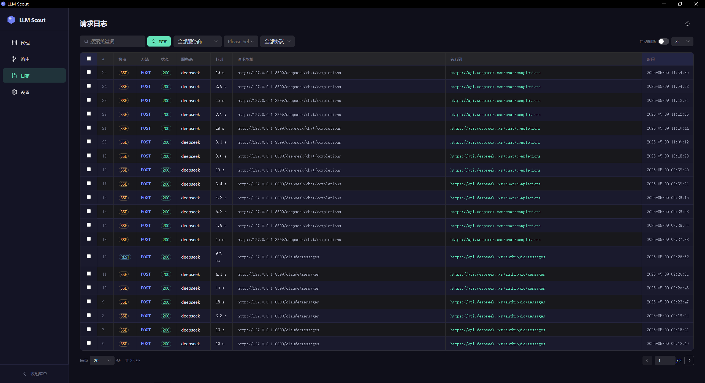
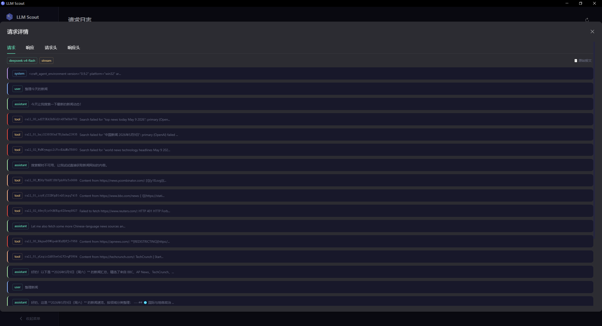

# LLM Scout

桌面端 LLM API 调试代理工具 — 捕获、记录、重放 LLM 请求。

A desktop LLM API debugging proxy — capture, inspect, and replay LLM API calls.

---

## 功能 / Features

- **代理转发 / HTTP Proxy** — 将本地请求转发到上游 LLM 服务商，支持 REST 和 SSE 流式响应
- **路由管理 / Route Rules** — 前缀剥离 / 精确匹配路由，灵活映射请求路径到目标域名
- **请求日志 / Log Viewer** — 分页浏览、关键词搜索、按状态码/协议/服务商筛选
- **详情查看 / Request Detail** — 请求/响应体、请求头/响应头，支持 JSON 与格式化视图切换
- **LLM 消息解析 / LLM Message Parser** — 解析 OpenAI 与 Anthropic (Claude) 格式，含 reasoning/thinking 块、tool calls、tool results
- **深色/浅色主题 / Dark & Light Theme** — 跟随系统或手动切换
- **响应式布局 / Responsive Layout** — 自适应窗口尺寸，移动端友好

## 截图 / Screenshots





## 技术栈 / Tech Stack

| 层 / Layer | 技术 / Technology |
|---|---|
| 桌面框架 / Desktop | [Wails v2](https://wails.io/) |
| 后端 / Backend | Go 1.25 |
| 前端 / Frontend | Vue 3 + NaiveUI + Vite 5 |
| 数据库 / Database | SQLite (modernc，纯Go / CGO-free) |
| 图标 / Icons | [Ionicons 5](https://ionicons.com/) |

## 项目结构 / Project Structure

```
llmscout/
├── app.go                    # Wails App 入口、Bind 方法
├── main.go                   # 应用启动、窗口配置
├── internal/
│   ├── route/                # 路由规则 CRUD + 路径匹配
│   ├── proxy/                # HTTP 代理引擎、SSE 流处理
│   ├── log/                  # 异步日志服务、筛选分页查询
│   └── storage/              # SQLite 数据库 (WAL 模式)
└── frontend/
    └── src/
        ├── App.vue           # 根组件：侧边栏布局、主题管理
        ├── composables/      # 主题 composable (useTheme)
        ├── views/            # 代理面板、路由面板、日志查看、设置
        └── components/       # LLM 消息解析、JSON 查看、Markdown 渲染、请求头展示
```

## 快速开始 / Quick Start

### 前置要求 / Prerequisites

- Go 1.25+
- Node.js 18+
- [Wails v2](https://wails.io/docs/gettingstarted/installation)

### 开发模式 / Dev Mode

```bash
wails dev
```

### 构建 / Build

```bash
# 当前平台 / Current OS
wails build

# Windows
wails build --clean --platform windows/amd64

# macOS
wails build --clean --platform darwin/universal
```

### 仅前端开发 / Frontend Only

```bash
cd frontend
npm install
npm run dev      # Vite dev server → http://localhost:5173
```

## 使用说明 / Usage

1. 在 **代理页面** 启动代理服务，默认监听 `localhost:8899`
2. 在 **路由页面** 配置转发规则（如 `/openai` → `api.openai.com`）
3. 将 LLM SDK 的请求地址指向 `http://localhost:8899/<你的路由路径>`
4. 在 **日志页面** 查看所有经过代理的请求，点击行查看详情

## License

MIT
